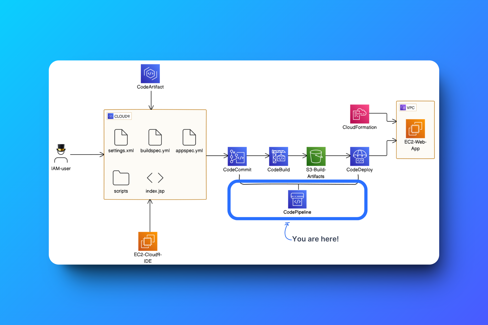

# CI/CD with CodePipeline

## Let's put our CI/CD pipeline together and automate software releases!

✅ CodeCommit and CodeArtifact to save copies of your web app's code and its dependencies.

✅ CodeBuild to compile and package your app's source code into a handy WAR file.

✅ CodeDeploy to deploy that WAR file on servers, so users can see your web app!

⏭️ AWS CodePipeline is there to automate the integrations between CodeCommit, CodeBuild and CodeDeploy.

1. Create a User (IAM)
2. Log out of your root user's AWS Account.
3. Log in using your IAM user's username and password in the .csv file.
4. Go to CloudFormation console.
5. Create a Stack.

